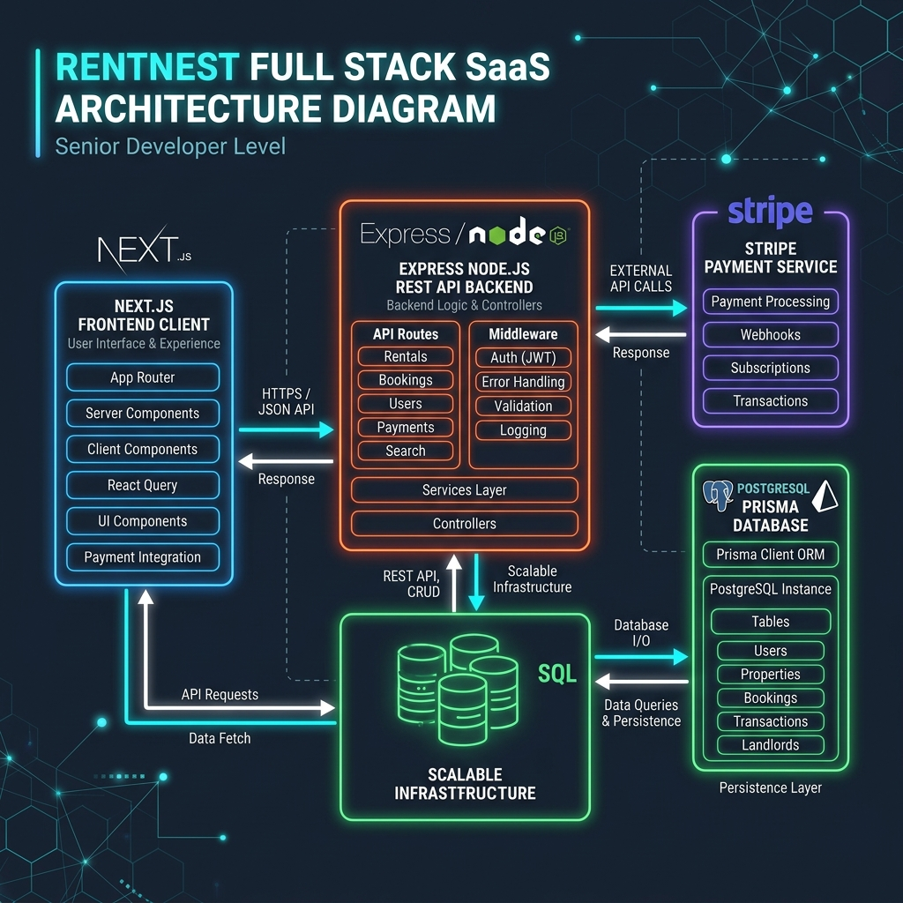
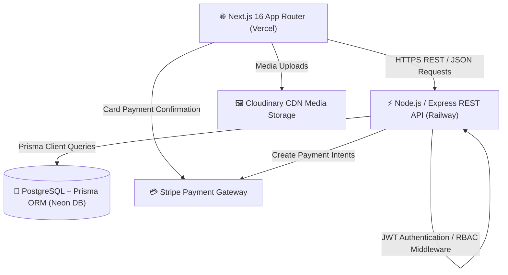
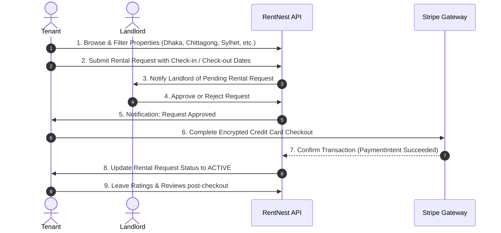
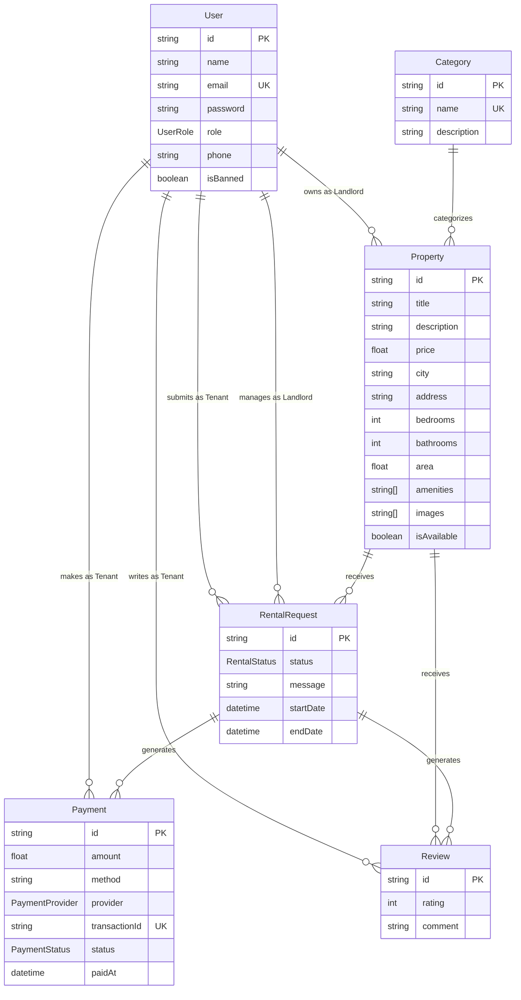

# RentNest — Enterprise Full-Stack Rental Property Marketplace

<p align="center">
  
</p>

<p align="center">
  <b>A Production-Grade Multi-Role Rental Marketplace Platform</b>
  <br />
  Built with Next.js 16, Node.js/Express, Prisma ORM, PostgreSQL, & Stripe Payments.
</p>

<p align="center">
  <a href="https://rent-nest-front-end.vercel.app/">
    
  </a>
  <a href="https://rentnest-fullstack-production.up.railway.app">
    
  </a>
  
  
  
  
</p>

---

## 🌐 Live Production Links

- **🚀 Live Frontend Web App:** [https://rent-nest-front-end.vercel.app/](https://rent-nest-front-end.vercel.app/)
- **⚡ Live Backend REST API:** [https://rentnest-fullstack-production.up.railway.app](https://rentnest-fullstack-production.up.railway.app)

---

## 📊 Technology Stack Comparison & Architecture Chart

| Layer / Area | Technology | Version | Purpose & Function | Key Developer Benefit |
| :--- | :--- | :--- | :--- | :--- |
| **Frontend Framework** | **Next.js (App Router)** | `v16.2` | Core Web Architecture & SSR/SSG | Turbopack compilation, instant page transitions, SEO optimization |
| **Language** | **TypeScript** | `v5.0` | End-to-End Type Safety | Compile-time error detection, shared contract types between API & UI |
| **Styling & Theme** | **Tailwind CSS + Glassmorphism** | `v4.0` | Enterprise UI Design System | Custom CSS variables, responsive design, dark/light theme switching |
| **UI Animations** | **Framer Motion** | `v12.0` | Smooth Micro-Interactions | Page transition animations, interactive card overlays, drawer motion |
| **State & Data Fetching**| **TanStack React Query** | `v5.0` | Asynchronous Server State | Automatic background refetching, query caching, optimistic UI updates |
| **Backend Runtime** | **Node.js / Express.js** | `v26 / v5` | RESTful API Services | Scalable routing, middleware validation, structured request handling |
| **Database & ORM** | **PostgreSQL + Prisma ORM** | `v7.8` | Persistence & Schema Migrations | Type-safe query builder, relation mapping, Neon serverless adapter |
| **Payments** | **Stripe API SDK** | `v22.0` | Online Credit Card Processing | PCI-DSS compliant checkout, PaymentIntent confirmation, Sandbox testing |
| **Media Management** | **Cloudinary API** | Latest | Image Cloud Storage & CDN | On-the-fly image optimization, responsive CDN delivery for property photos |
| **Cloud Hosting** | **Vercel & Railway** | Production | Frontend & Backend Deployment | Continuous deployment, automated SSL, global edge distribution |

---

## 🌟 Top Flagship Features

- 🏠 **Smart Property Discovery & Multi-Criteria Filtering**: Search 30+ verified properties across 7 major Bangladeshi cities with live debounced location search, price budget range slider ($0 - $300,000), category filters, and bedroom selectors.
- 💳 **Stripe Secure Checkout**: End-to-end encrypted card checkout flow supporting Visa, MasterCard, Amex, and Discover with 1-click sandbox test auto-fill capability.
- 🛡️ **Multi-Role Access Control (RBAC)**: Tailored workflows for **Tenants** (request & pay), **Landlords** (post listings & screen applicants), and **Admins** (user management & platform stats).
- 🔄 **Automated Rental Request Lifecycle**: Seamless status updates (`pending` → `approved` → `active` → `completed`) with background notification triggers.
- 🎨 **Enterprise Glassmorphic Design System**: Custom-built 3D brand logo, adaptive browser favicons, dark/light mode toggle, and micro-animated UI cards.
- ⭐ **Verified Tenant Reviews & Ratings**: 1-5 star review system restricted strictly to tenants with completed rental stays.
- 📈 **Real-Time Platform Analytics**: Admin overview of total revenue, active listings, tenant requests, and landlord analytics.

---

## ⚡ Key Engineering Challenges & Solutions

### 1. 🔌 Prisma 7 Driver Adapter & SSL Connection Handshake
- **Challenge**: Connecting Prisma 7 client via `@prisma/adapter-pg` pool resulted in `Error opening a TLS connection` when switching between local PostgreSQL databases and hosted Prisma Accelerate / Neon SSL connections.
- **Solution**: Configured a dynamic factory in `src/config/prisma.ts` that detects the connection string type (`prisma.io` vs standard PG) and sets `ssl: false` for the PG Pool instance, allowing node-postgres to safely inherit `sslmode=require` from the connection parameters without breaking TLS handshakes.

### 2. 🛡️ Preventing Insecure Connection Autofill Warnings in Dev
- **Challenge**: Local development over HTTP (`http://localhost`) caused Chrome and Edge to output an intrusive red warning bar (`Automatic payment methods filling is disabled because this form does not use a secure connection`).
- **Solution**: Replaced default browser form behavior with isolated controlled React inputs (`cardNumber`, `expiry`, `cvc`, `cardHolder`), added `autoComplete="off"`, `noValidate`, and `data-lpignore="true"` on the form wrapper, and added a **⚡ Quick Fill Test Card** button for seamless developer testing.

### 3. 🔐 Multi-Role Authorization & Route Guard Isolation
- **Challenge**: Preventing unauthorized access or privilege escalation across Tenant, Landlord, and Admin dashboard views and API routes.
- **Solution**: Built a centralized Next.js proxy middleware and backend JWT `protect` + `restrictTo(...roles)` higher-order middleware layers that enforce strict role assertions at both the route level and database query scope (`tenantId === req.user.id`).

### 4. 🔄 Stripe PaymentIntent Async Synchronization
- **Challenge**: Ensuring that rental request status transitions (`approved` → `active`) occur atomically only after Stripe payment confirmation succeeds.
- **Solution**: Implemented a two-step payment transaction architecture using `paymentApi.createIntent()` and `paymentApi.confirm()`. The backend executes a Prisma `$transaction` that updates both the payment record status to `COMPLETED` and the rental request status to `ACTIVE` in a single atomic database operation.

### 5. ⚡ Debounced Filtering & Query Performance
- **Challenge**: Rapid typing in search inputs triggered excessive API re-renders and network request thrashing.
- **Solution**: Combined React `useDebounce` hooks with TanStack Query caching (`staleTime: 30000`). Filter state mutations update local UI state instantaneously while delaying network requests by 400ms.

---

## 🏗️ System Architecture

RentNest is designed following a **decoupled Client-Server Architecture** with strict separation of concerns, robust security middleware, type-safe database queries via Prisma ORM, and third-party payment & media service integrations.

<p align="center">
  
</p>

### High-Level Component Flow Diagram



---

## 💡 How It Works (Core User Journeys)

RentNest implements three distinct workflow paths tailored for **Tenants**, **Landlords**, and **Admins**:



---

## 🗄️ Database ERD & Data Schema (Prisma PostgreSQL)

RentNest uses **PostgreSQL** with **Prisma ORM** for type-safe database queries.



---

## 📡 REST API Specifications

### Authentication Routes (`/api/auth`)
| Method | Endpoint | Description | Access |
| :--- | :--- | :--- | :--- |
| `POST` | `/api/auth/register` | Register a new user (`tenant` / `landlord`) | Public |
| `POST` | `/api/auth/login` | Authenticate user & return JWT token | Public |
| `GET` | `/api/auth/me` | Fetch authenticated user profile | Authenticated |

### Property Routes (`/api/properties`)
| Method | Endpoint | Description | Access |
| :--- | :--- | :--- | :--- |
| `GET` | `/api/properties` | Fetch paginated & filtered property listings | Public |
| `GET` | `/api/properties/:id` | Fetch single property by ID | Public |
| `GET` | `/api/properties/stats` | Fetch system-wide platform statistics | Public |

### Rental Request Routes (`/api/rentals`)
| Method | Endpoint | Description | Access |
| :--- | :--- | :--- | :--- |
| `POST` | `/api/rentals` | Submit a new rental booking request | Tenant |
| `GET` | `/api/rentals/my` | Fetch tenant's submitted rental requests | Tenant |
| `GET` | `/api/rentals/:id` | Fetch specific rental request details | Authenticated |

### Payment Routes (`/api/payments`)
| Method | Endpoint | Description | Access |
| :--- | :--- | :--- | :--- |
| `POST` | `/api/payments/create-payment-intent` | Generate Stripe Payment Intent & Secret | Tenant |
| `POST` | `/api/payments/confirm` | Confirm completed Stripe transaction | Tenant |
| `GET` | `/api/payments` | Fetch user payment history | Authenticated |

### Landlord Routes (`/api/landlord`)
| Method | Endpoint | Description | Access |
| :--- | :--- | :--- | :--- |
| `GET` | `/api/landlord/properties` | Fetch landlord's owned properties | Landlord |
| `POST` | `/api/landlord/properties` | Create a new property listing | Landlord |
| `PATCH` | `/api/landlord/properties/:id` | Update an existing property | Landlord |
| `DELETE` | `/api/landlord/properties/:id` | Delete a property listing | Landlord |
| `GET` | `/api/landlord/requests` | Fetch requests for landlord's properties | Landlord |
| `PATCH` | `/api/landlord/requests/:id` | Approve or Reject a tenant request | Landlord |

---

## 💻 Local Development Setup & Database Seeding

### Prerequisites
- Node.js `v18.0.0` or higher
- npm or pnpm
- PostgreSQL Database Connection URL

### 1. Backend Setup & Seeding

```bash
# Navigate to backend directory
cd "RentNest Backend"

# Install dependencies
npm install

# Setup environment variables
cp .env.example .env

# Run Prisma schema build & generate client
npm run prisma:build

# Seed Database with 30+ properties and 50+ total records
npm run seed

# Start backend dev server
npm run dev
# Running on http://localhost:5050
```

### 2. Frontend Setup

```bash
# Navigate to frontend directory
cd "RentNest Frontend"

# Install dependencies
npm install

# Setup environment variables
cp .env.example .env.local

# Start Next.js dev server
npm run dev
# Running on http://localhost:3000
```

---

## 🔑 Pre-Seeded Test Credentials

Default Password for all test accounts: **`Password123!`**

| Role | Name | Email | Phone |
| :--- | :--- | :--- | :--- |
| **Admin** | Rakibul Islam | `rakibul@rentnest.com` | `+8801711112233` |
| **Landlord** | Toufik Hossain | `toufik@rentnest.com` | `+8801822223344` |
| **Tenant** | Tanvir Ahmed | `tanvir@rentnest.com` | `+8801933334455` |

*Stripe Sandbox Test Card:* `4242 4242 4242 4242` · Any Expiry (`12/28`) · Any CVC (`123`).

---

## 📄 License & Author

Developed with ❤️ for **RentNest Full Stack Platform**.
- **Live App:** [https://rent-nest-front-end.vercel.app/](https://rent-nest-front-end.vercel.app/)
- **API Endpoint:** [https://rentnest-fullstack-production.up.railway.app](https://rentnest-fullstack-production.up.railway.app)
